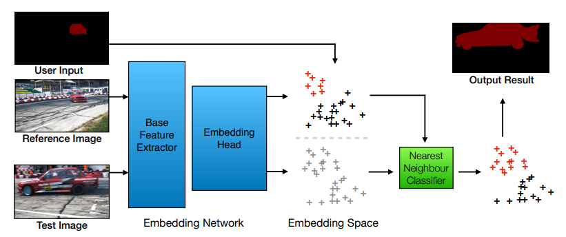

# Papyrus4Robotics Perception Components

## Video Object Tracking through Segmentation Embeddings

Based on the embedding method by: 

`Chen, Y., Pont-Tuset, J., Montes, A., & Van Gool, L. (2018). Blazingly fast video object segmentation with pixel-wise metric learning.`



---

### Usage

The basic structure of a command looks like:

```
python main.py --mode <mode> --custom_data <custom_data_directory> --seg_dir <ground_truth_segmentation_directory>
```

When no custom data is given, the DAVIS2016 dataset is used for either training or validation. Several choices for `mode` include:

- 'train': currently always trains on DAVIS2016 480p training dataset. No need for `custom_data` or `seg_dir` parameters.

- 'validation': by default takes DAVIS2016 480p validation data, but can be overwritten to use custom data images in `custom_data` with their corresponding ground truth segmentation masks in `seg_dir`. The ground truth is used to compute the Intersection over Union metric at the end.

- 'inference': At test time, no ground truth is known, hence `seg_dir` should be empty. Instead, a single annotated first frame should be given in the same directory as `custom_data` called "AnnotatedFrame.png".

In the command you can also specify `--batch_size` for multi-batch processing. In case a model has already been trained before, using `--load` will ... well, it will load the existing model.

You can use `--videos bear soapbox etc` to load certain videos from the dataset. These are then trained/validated separately.


## C++ Torch Script

The above **PyTorch** implementation of the model is trained on Python, but might need to be used in a C++ application for evaluation. This is possible through **LibTorch**, the conversion process will be described in the following.

### Conversion

In order to run **PyTorch** models in C++, we need to convert the model into a **Torch Script**. How we do it is through *Tracing*. This mechanism takes an example input, puts it through the PyTorch network and gathers gradients and network information in this manner.

> **Important note**: if you wish to evaluate the model on a CPU, you should be tracing the model on a CPU too.

The first step is to fully load your trained model `model`. Then create an example input with the correct shape (using a random values) `example`. Lastly run it through the network and store the traced model as follows:

```
traced_script_module = torch.jit.trace(model, example)
traced_script_module.save("/some_dir/tracedModel.pt")
```

### Loading Torch Script in LibTorch

Now that we have the trained model as a traced script, we can load it in C++ using the **LibTorch** library. After installing the library, you can include the `<torch/script.h>` header and run:

```
torch::jit::script::Module module = torch::jit::load(model_path);
```

A more detailed explanation can be found in <https://pytorch.org/tutorials/advanced/cpp_export.html>.
