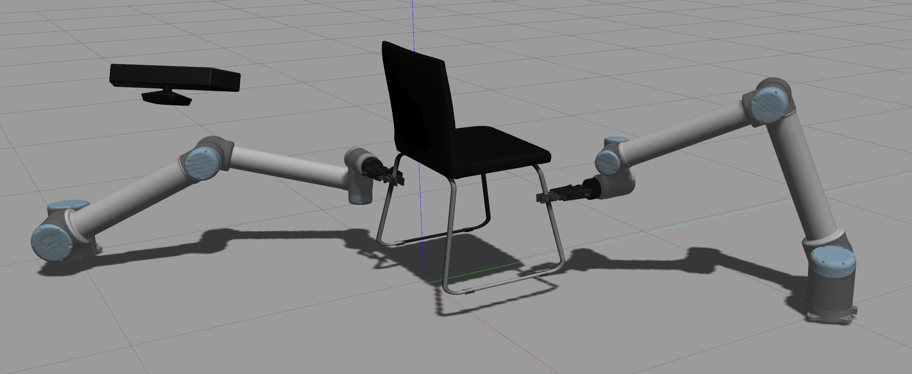
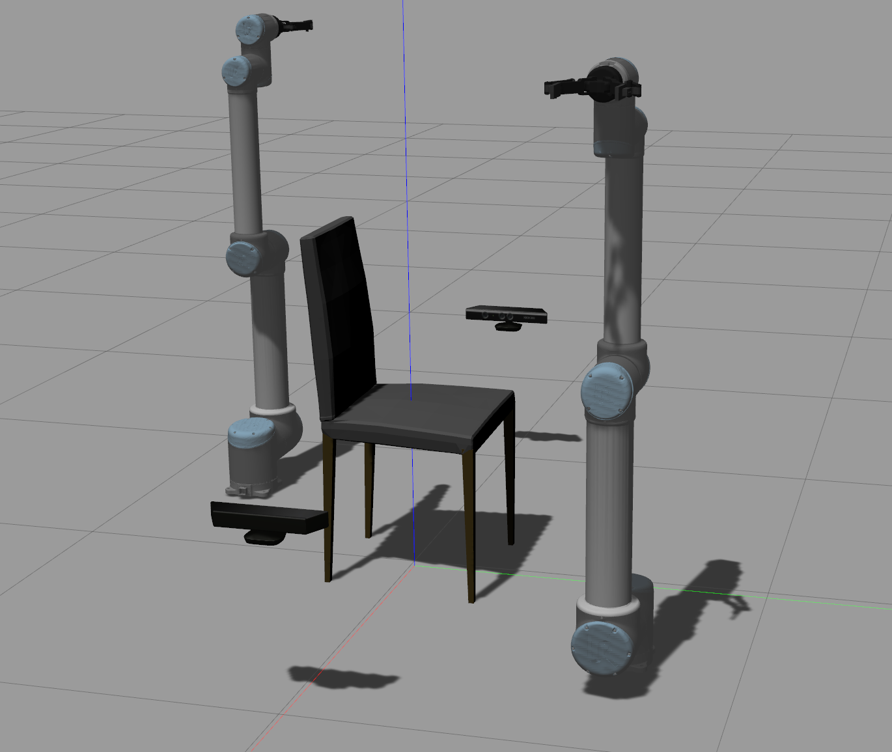
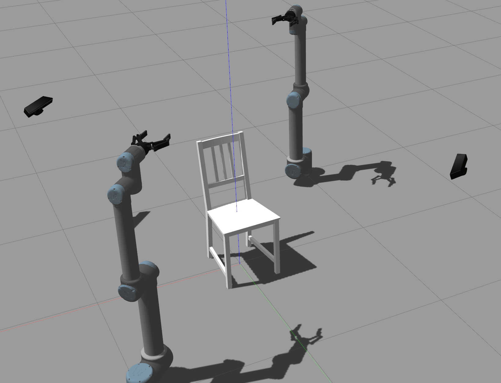

# Papyrus4Robotics Perception Components

## Dual-Arm Grasping of Chairs

The goal of this project is to detect grasps for a dual-arm manipulation of chairs.
In addition, we have done our best to provide a simulation in Gazebo to see the algorithms in action.

### Overview

The project contains two methods for grasp detection.
The first one is rather simple and restricted using basic OpenCV image processing.
Its implementation is contained in the *chair_manipulation_grasp_detection_simple* ROS package.
Our second approach is based on an advanced grasping pipeline.
It is located in the *chair_manipulation_grasp_detection_advanced* ROS package.
Both packages output the tf frame for the grasp poses, named **robot1_grasp** and **robot2_grasp**.
These are then taken as input by the grasp planner contained in the *chair_manipulation_grasp_planner* package that plans and executes the grasps using Moveit!.
The *chair_manipulation_gazebo* package contains launch files to run the simulation.

### Installation

As a prerequisite, you must have ROS melodic installed on a Ubuntu 18 machine.

First, we have to install the fgt library system wide from source.

    $ cd ~
    $ git clone https://github.com/gadomski/fgt
    $ cd fgt
    $ mkdir build
    $ cd build
    $ cmake ..
    $ sudo make install

Now, we install a compiler cache to decrease the compile time.

    $ sudo apt-get install ccache
    $ echo 'export PATH=/usr/lib/ccache:$PATH' >> $HOME/.bashrc
    $ source $HOME/.bashrc 

Next, we setup the workspace for the project.

    $ cd ~
    $ mkdir chair_manipulation_ws
    $ cd chair_manipulation_ws
    $ mkdir src
    $ catkin init --workspace .
    $ git clone --recurse-submodules https://github.com/robmosys-tum/PapPercComp  src
    $ wstool init src
    $ wstool merge -t src src/PapPercComp/chair_manipulation/dependencies.rosinstall
    $ wstool update -t src
    $ rosdep install -y --from-paths src --ignore-src --rosdistro ${ROS_DISTRO}
    $ catkin config --cmake-args -DCMAKE_BUILD_TYPE=Release 
    $ catkin build

### Usage

#### Running the simple algorithm

In order to run the simulation, you need four terminals.
We noticed that ROS gets stuck quite often if we try to launch everything from a single launch file.
Don't forget to run

    $ source devel/setup.bash

for every new terminal.
Please execute the following steps in the exact same order.

1. Bringup the scene.

        $ roslaunch chair_manipulation_gazebo scene_bringup_simple.launch

    You can change the chair by specifying the **world_id** argument:

        $ roslaunch chair_manipulation_gazebo scene_bringup_simple.launch world_id:=2

    All worlds are contained inside the chair_manipulation_gazebo/worlds directory.

2. Now, go inside Gazebo and press the play button.

3. Bringup moveit.

        $ roslaunch chair_manipulation_gazebo moveit_bringup.launch

4. Start the node that lifts the chair.

        $ roslaunch chair_manipulation_gazebo lift.launch

    Wait until it says "Start goal PREPARE".
    This will now wait for the grasp tfs.

5. Finally, launch the detection algorithm.

        $ roslaunch chair_manipulation_gazebo detection_simple.launch

#### Running the advanced algorithm

1. The advanced algorithm requries you to first create the grasp database.

        $ roslaunch chair_manipulation_grasp_detection_advanced create_grasp_database.launch

2. Bringup the scene.

        $ roslaunch chair_manipulation_gazebo scene_bringup_advanced.launch

    Again, you can change the chair by specifying the **world_id** argument:

        $ roslaunch chair_manipulation_gazebo scene_bringup_simple.launch world_id:=2

3. Now, go inside Gazebo and press the play button.

4. Bringup moveit.

        $ roslaunch chair_manipulation_gazebo moveit_bringup.launch

5. Start the node that lifts the chair.

        $ roslaunch chair_manipulation_gazebo lift.launch

    Wait until it says "Start goal PREPARE".
    This will now wait for the grasp tfs.

6. Finally, launch the detection algorithm.

        $ roslaunch chair_manipulation_gazebo detection_advanced.launch

### FAQ

Q: The catkin build fails with the message

    c++: internal compiler error: Killed (program cc1plus)

A: These types of errors often happen when the compiler runs out of memory which is typical for virtual machines.
In this case it helps to allocate more memory for the virtual machine. It also may help to simply rerun catkin build.

Q: When launching scene_bringup_simple.launch or scene_bringup_advanced.launch Gazebo does not start and I get red error messages in the output.

A: As said earlier, for some reason the tools sometimes kind of conflict with each other and doesn't launch. 
Just hit Ctrl+C and launch it again. If this doesn't work three times in a row, then some dependencies are missing.
Please make sure that you strictly followed the installation steps.

Q: The motion planning framework fails to find a plan even if the grasp poses seem to be clearly reachable.

A: Unfortunately, we could not figure out how to fix this problem.
The topic of motion planning is quite a complex one on its own and we could not solve every issue regarding it.
In general, it should be noted that Moveit! was not designed for performing simultaneous multi-arm grasping and especially not for larger objects.
Only by using hacky tricks, we are able to make Moveit! do what we want.
However, implementing the dual-arm motion planning correctly would require non-trivial adaptions to the framework which was absolutely not possible in the scope of this project as we mainly focused on the detection part.

Q: The robot makes strange acrobatic movements to approach the grasping position.

A: This is due to the nature of search-tree-based motion planners that are used here.

Q: The robot completely freaks out (slides along the ground or collides with the chair) when executing the grasp and lift phases.

A: Unfortunately, the planner does not consider singular configurations which can lead to such catastrophical behaviors. Again, a more sophisticated planner would be required here.